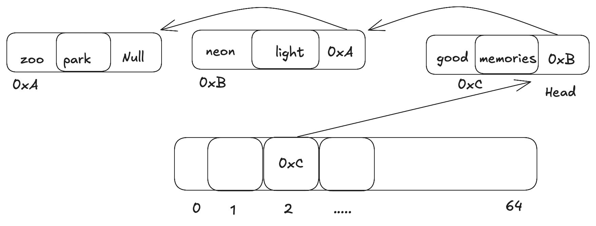

Toy-Redis - A minimal clone of Redis in x86-64 Assembly:

A low-level, educational project that reimagines a key value store using x86-64 assembly.
It was fun to peel out the abstractions and build this project in low-level assembly which is close to the metal!!!

Features:

	•	Simple key value store supporting put, get , delete operations
	•	Hashtable with 64 buckets and chaining for collision resolution
    	•	Manual memory management with brk syscall.
	•	Memory reuse via custom free list allocator

🚀 Getting Started

🔧 Prerequisites

	•	OS: Debian/Ubuntu Linux
	•	Tools: build-essential, gdb, make
 
	        sudo apt update && sudo apt install build-essential gdb make

🔨 Build Instructions

▶️ Run the Program

Credits:

Massive thanks to Abhinav Upadhyay for sharing his deep insights on low-level systems.
Follow his amazing Substack at 👉 https://blog.codingconfessions.com/

🧠 Lessons Learned

	•	Parsing and string manipulation in assembly
	•	Building stack frames for function-local variables
	•	Manual memory management via brk syscall
	•	Creating and reusing a free list to avoid excessive syscalls
	•	Deep understanding of how high-level abstractions map to machine-level execution
